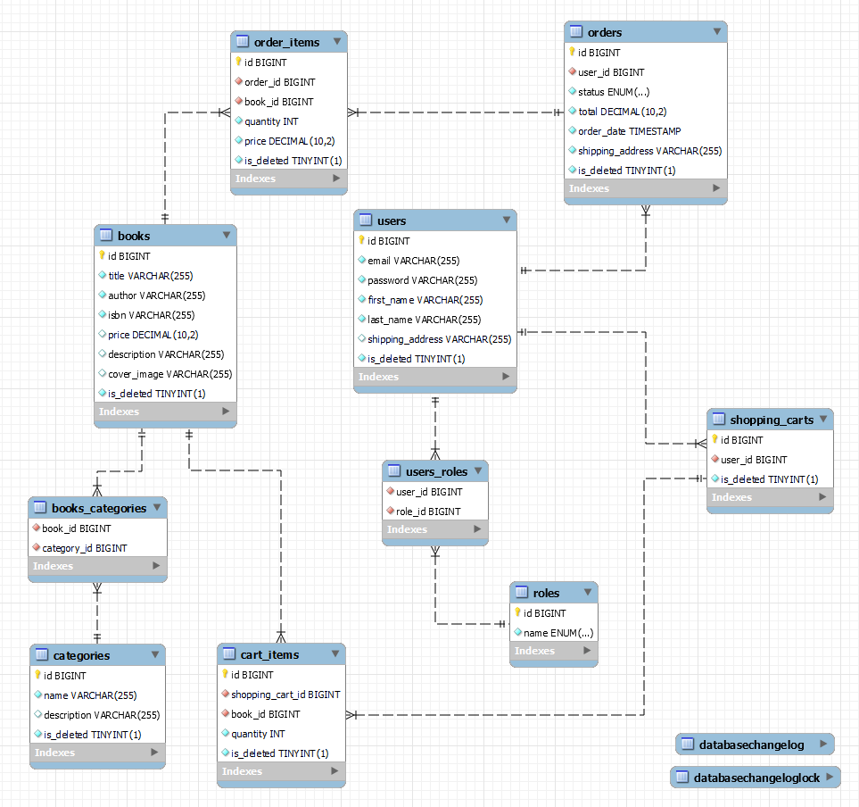

# Bookstore API - Online Shop 📖

Introducing the Bookstore API - Your Online Bookshop! This project is designed to offer a robust online bookstore API powered by Spring Boot. It covers various aspects including user management, book catalog management, shopping cart functionality, order processing, and more. Dive in to discover its features, functionalities, and setup instructions.

## Table Of Content
- [Technologies Used](#technologies-used)
- [Key Functionalities](#key-functionalities)
- [Video Presentation](#video-presentation)
- [SQL Database Diagram](#sql-database-diagram)
- [Setup Instructions](#setup-instructions)
- [Rising to Challenges](#rising-to-challenges)
- [Contact](#contact)

## Technologies Used

- **Java**: Programming language used as the foundation for the project.
- **Spring Boot**: Framework for building robust Java applications.
- **Spring Security**: Provides authentication and authorization capabilities.
- **JWT**: (JSON Web Token) Standard for securely transmitting information between parties as a JSON object.
- **Spring Data JPA**: Simplifies the data access layer by abstracting away the boilerplate code.
- **Mapstruct**: Used for mapping between DTOs and entities.
- **Lombok**: Library for reducing boilerplate code in Java classes.
- **Maven**: Build automation tool used for managing dependencies and building the project.
- **Liquibase**: Manages database schema changes over time.
- **Jackson**: Provides JSON serialization and deserialization capabilities in Java.
- **Swagger**: Generates interactive API documentation.
- **MySQL**: Database for storing application data.
- **Docker**: For containerizing the application.
- **JUnit 5**: Framework for unit testing.
- **Mockito**: Framework for mocking objects in tests.

## Key Functionalities

### Postman

Feel free to explore the Bookstore API yourself using my Postman collection. If you have any questions or encounter any issues, don't hesitate to reach out. Happy testing!

[](https://god.gw.postman.com/run-collection/32395887-2c05542b-d87d-48ed-be3c-6eca6b546f65?action=collection%2Ffork&source=rip_markdown&collection-url=entityId%3D32395887-2c05542b-d87d-48ed-be3c-6eca6b546f65%26entityType%3Dcollection%26workspaceId%3D1b3a52a2-587d-4ebc-940e-048110041ee1)

Below, you'll find detailed explanations for each endpoint in the Postman collection, helping you navigate and understand the functionalities of the Bookstore API more effectively.


### Access to endpoints
🟩 - publicly available  
🟨 - for logged-in users  
🟥 - for administrators  


### User Management

- 🟩 `POST: /api/auth/registration` - **User Registration**: New customers can register with their email, password, and personal details.
- 🟩 `POST: /api/auth/login` - **User Authentication**: Secure login mechanism for registered users.

### Book Management

- 🟨 `GET: /api/books` - **Retrieve Book Catalog**: Users can browse the catalog of available books.
- 🟨 `GET: /api/books/{id}` - **View Book Details**: Users can also check information about each book individually.
- 🟨 `GET: /api/books/search` - **Search Books**: Users can search for books based on various parameters.
- 🟥 `POST: /api/books` - **Add New Book**: Admin users can add new books to the catalog.
- 🟥 `PUT: /api/books/{id}` - **Update Book Details**: Admin users can update existing book details.
- 🟥 `DELETE: /api/books/{id}` - **Delete Book**: Admin users can remove books from the catalog.

### Category Management

- 🟨 `GET: /api/categories` - **Retrieve Categories**: Users can view the list of available categories.
- 🟨 `GET: /api/categories/{id}` - **View Category**: Users can also check information about each category individually.
- 🟨 `GET: /api/categories/{id}/books` - **Get Books by Category**: Users can retrieve all books belonging to a specific category.
- 🟥 `POST: /api/categories` - **Create Category**: Admin users can create new categories for books.
- 🟥 `PUT: /api/categories/{id}` - **Update Category**: Admin users can update category details.
- 🟥 `DELETE: /api/categories/{id}` - **Delete Category**: Admin users can delete categories.

### Shopping Cart

- 🟨 `GET: /api/cart` - **View Cart**: Users can view the contents of their shopping cart.
- 🟨 `POST: /api/cart` - **Add to Cart**: Users can add books to their shopping cart.
- 🟨 `PUT: /api/cart/cart-items/{id}` - **Update Cart**: Users can update the quantity of a specific item in their cart.
- 🟨 `DELETE: /api/cart/cart-items/{id}` - **Remove from Cart**: Users can remove a specific item from their cart.

### Order Management

- 🟨 `GET: /api/orders` - **View Orders History**: Users can view all their orders history.
- 🟨 `GET: /api/orders/{id}/items` - **View Order Items**: Users can view all items included in a specific order.
- 🟨 `GET: /api/orders/{orderId}/items/{itemId}` - **View Specific Order Item**: Users can check details of a particular item within an order.
- 🟨 `POST: /api/orders` - **Place Order**: Users can place orders for the books in their cart.
- 🟥 `PATCH: /api/orders/{id}` - **Update Order Status**: Admin users can update the status of orders.

## Video Presentation

For a visual demonstration of how the Bookstore API works and its various functionalities, you can watch the video presentation available [here](https://www.loom.com/share/2464c0541478423c9b88868330317bd8). In this presentation, I walk through the key features of the application, demonstrate its usage with examples, and provide insights into the development process.

## SQL Database Diagram
Below is a simplified representation of the database schema used in the Bookstore API:



This diagram illustrates the relationships between different entities in the database, including tables for users, books, categories, shopping carts, orders, and more.

## Setup Instructions

1. Clone the repository to your local machine.
2. Ensure you have Docker installed and Docker Engine running.
3. Navigate to the project directory.
4. Run `./mvnw clean package` to create a .jar file.
5. In the .env file you should provide necessary DB and Docker variables, here is an example:  
```mysql
MYSQLDB_USER=root  
MYSQLDB_ROOT_PASSWORD=1234  
MYSQLDB_DATABASE=test  
MYSQLDB_LOCAL_PORT=3307  
MYSQLDB_DOCKER_PORT=3306  
SPRING_LOCAL_PORT=8080  
SPRING_DOCKER_PORT=8080  
DEBUG_PORT=5005
```
6. Run `docker compose up -d --build` to start the application and MySQL database.
7. Feel free to test my application using Postman/Swagger.  
   **Postman**: Keep in mind that you have to pass Authorization (Bearer Token) that you receive when logging in.  
  Do you want to test admin features? Here are credentials of sample admin:  
   ```json
   {
   "email": "matthew@admin.com",
   "password": "1234"
   }
   ```
8. To stop and remove containers use `docker compose down`.

## Rising to Challenges

Since this is my first relatively comprehensive project, I encountered a few difficulties while working on it. Some of which I was able to deal with fairly quickly, but some of which were able to keep me up at night, solving the most difficult problems was what satisfied me the most. The issues I encountered allowed me to develop the ability to effectively search for solutions, whether using the information in the available documentation, the reliable Stack Overflow or sites like Baeldung. Thanks to the knowledge I gained, I know that the future obstacles in my path I will be able to overcome more and more efficiently.

## Contact
Thank you for taking the time to explore my Bookstore API!

📧 Want to get in touch? Please, feel free to send me an email at rostek.mateusz@outlook.com
